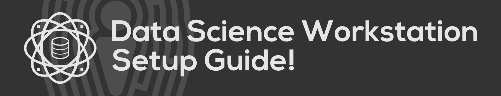

# Data Science Workstation Setup Guide!
Welcome! If you are totally new to coding, what you are reading right now is called a **README**, and this README is part of a larger grouping of coding files called a **Git code repository**. This particular README that you are currently reading is created as part of a file called `README.md`. Written using an easy-to-learn syntax called **"markdown,"** READMEs help other developers to learn how to best navigate your code repository. In this particular case, we are using the README to introduce this data science workstation setup guide as well as how to properly navigate it.

The best part about everything we'll be installing in this guide is that it is all **FREE**! This is because everything we will be downloading is referred to as **open source**, meaning that these things are maintained by the general public and can be updated by anybody. Of course, open source tools go through rigorous peer review processes, so you can be confident that I'm only having you install things that have been thoroughly vetted and verified by professional software developers.

If you already have some experience doing software development, it may be that you already have some of these tools (or close equivalents) already installed. In that case, feel free to jump around to install what you need. If you are totally new to software development, I'd recommend following sticking with the path as it is laid out.

# Hardware Recommendation
Before moving forward, you might be curious if you need any specific hardware. When you're first getting up and going, I think any modern PC will work. I will recommend that it's any machine that has either the Windows or macOS operating systems. Tablets (e.g. iPads) will unfortunately not work, and I can't say about Chromebooks. But don't worry about things like RAM or processor speed!

In case you are curious what I personally use, I have a 2020 Mac Mini with Apple's new M1 chip as a desktop computer running macOS Monterey, and as a "2-in-1" tablet / laptop combo, I own a Microsoft Surface Pro 8 running Windows 11. Thus, the tutorials written as part of this repository are wrriten **for both Mac and Windows users!**

# Suggested Installation Order
As some of the installations in this tutorial require prerequisite dependencies, here is the order I suggest you install these tools. Additionally, I also marked which tools are generally required for your data science work and which are more optional. I provide deeper descriptions for each of these tools in their own respective tutorials linked in tandem.

## Required Installations

- [Command Line Interface (CLI)](command-line-interface/README.md)
- [Git](git/README.md)
- Python
- Integrated Development Environment (IDE)
- Docker

## Optional Installations
- Amazon Web Services (AWS) CLI
- Kubernetes (minikube)
- HashiCorp Terraform