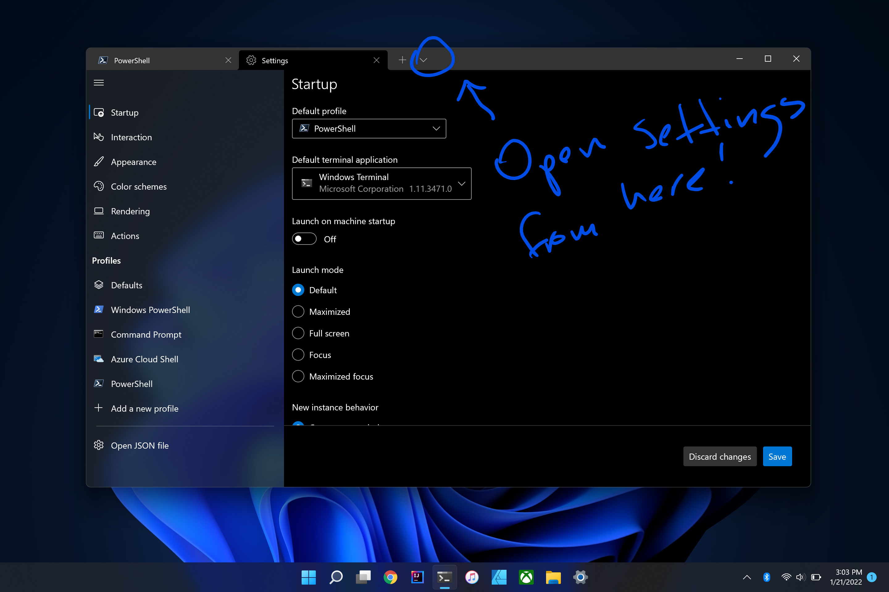
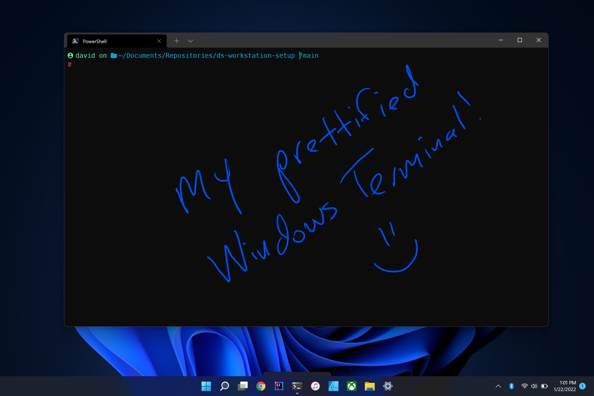
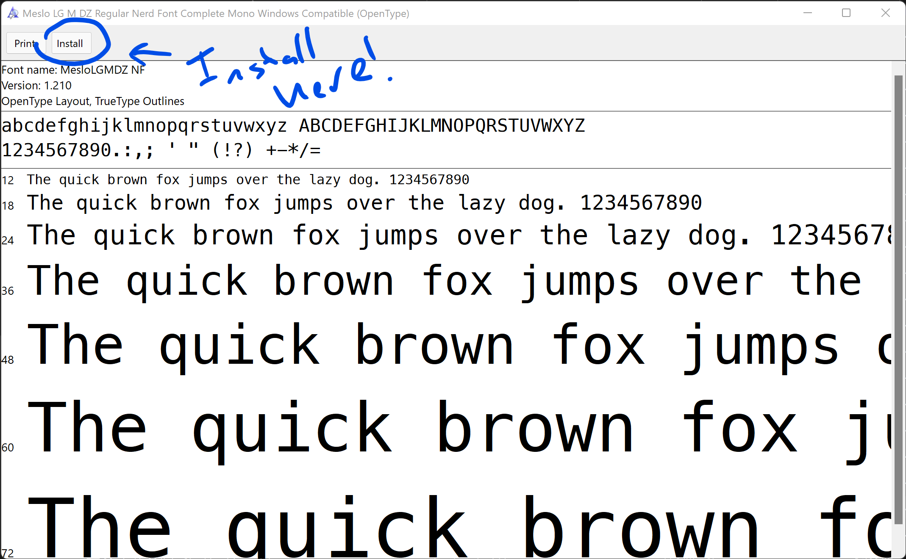
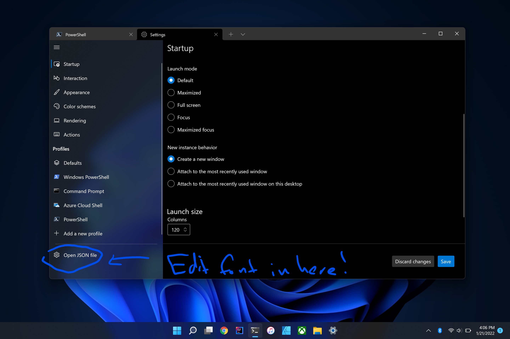
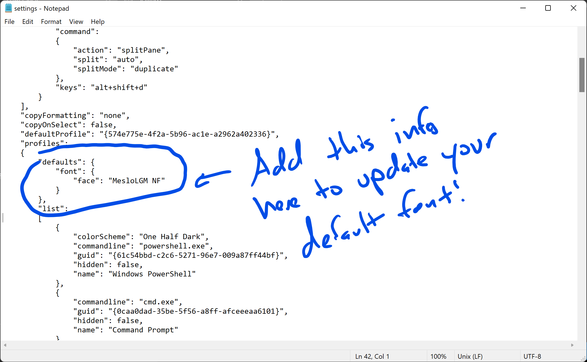
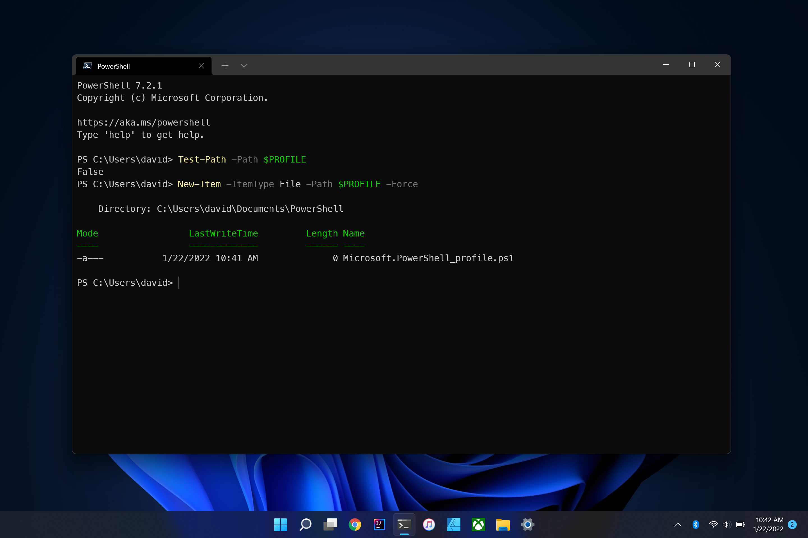
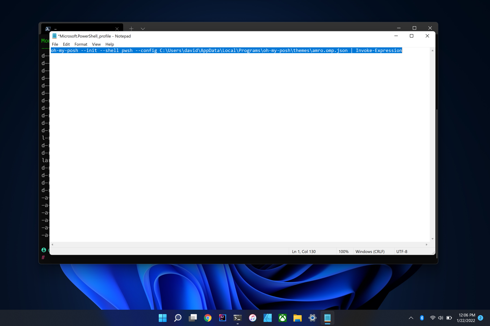
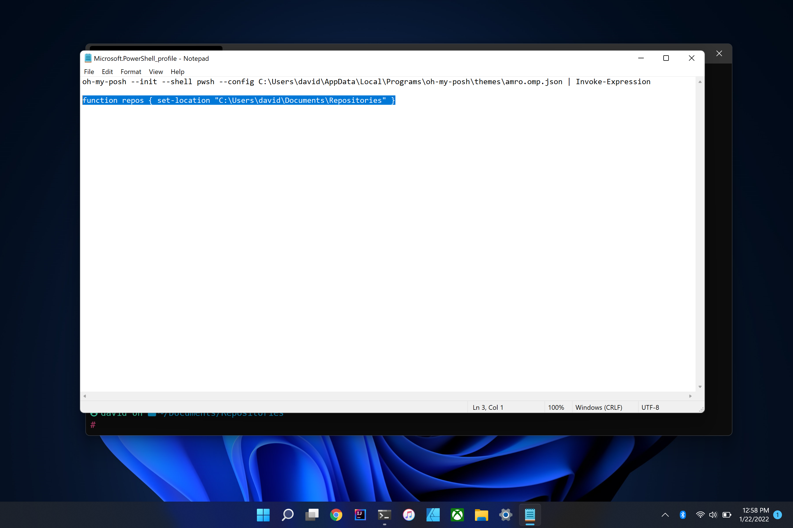

# Command Line Interface (CLI)


## What is the Command Line Interface (CLI)?
The command line interface, or CLI, is the one of the primary ways in which a software developer interacts with a computer. Most programs you are familiar with run as Graphical User Interfaces, or GUIs. (Pronounced "gooey".) As great as GUIs are, they are very subjective from program to program. For example, can you remember how to access the settings for Facebook or Twitter on your phone? Chances are they're in different places! The CLI keeps things a lot more basic, which is helpful for developers as allows for complex functionality to be run in a more simplified, text-based interface.

Mac and Windows each have their own respective CLIs, and for data science work, we're going to focus more on the Mac flavor of this. It's actually not Mac but Linux as the macOS is built on top of Linux. In case you're not aware, Linux is an operating system (OS) similar to how Windows and macOS are OSs. Linux comes in many flavors, inlcuding Debian and Ubuntu, and Linux can range from being very simple to being very complex due to its customizability. For deploying software programs to production environments, many of these software programs are run on Linux.


## Installation on Mac
As noted before, the Mac CLI already uses Linux commands, so you can actually begin immediately using the default `Terminal` application that comes bundled with every Mac. Technically, `Terminal` is ready to go right out of the box. You're welcome to begin using it immediately. But... most developers don't like using `Terminal` immediately like that. Instead, many developers (including myself) prefer to use a different CLI program called `iTerm2`. If you're okay with just using `Terminal`, that is totally fine, but if you'd like to learn more about `iTerm2`, see the next subsection.

### Customization with iTerm2
While there is nothing wrong with using the default `Terminal` application, I personally prefer to use `iTerm2`. If you would like to install `iTerm2`, navigate to this website and follow the download instructions: [Link to iTerm2 website](https://iterm2.com/).

There is more customizability we can do to `iTerm2`, but for now we're going to keep things basic. I might come back and update this Markdown at a later time with those customizability features!


## Installation on Windows
While macOS is built on top of Linux and therefore uses Linux commands right out of the box, this is not the case with Windows. By default, Windows instead makes use of its own CLI called the `Command Prompt`. Because the Command Prompt uses radically different commands from standard Linux commands, we will NOT be making use of the Command Prompt at all.

In an effort to remedy this, Microsoft has started bundling a program called `Windows Terminal` (with another program called `PowerShell` as a profile) with newer versions of Windows. `Windows Terminal` and `PowerShell` have been designed to emulate those same Linux commands we see across macOS and other Linux machines. If these are not already installed on your computer, you can install these directly from the Microsoft Store. Here are the appropriate links for those:

- [Link to install `Windows Terminal`](https://www.microsoft.com/store/productId/9N0DX20HK701)
- [Link to install `PowerShell`](https://www.microsoft.com/store/productId/9MZ1SNWT0N5D)

To actually make use of `Windows Terminal` with the `PowerShell` profile, open `Windows Terminal` and navigate to the settings. (The screenshot below illustrates where this is, if you can't find it!) Under the "Default profile" dropdown menu, select "PowerShell" (NOT to be confused with Windows PowerShell, which is something different). Then click the "Save" button the bottom right hand corner of the UI.



Technically, this is all you need to do to get `Windows Terminal` working, but there are some cool things we can do with `Windows Terminal` / `PowerShell` that aren't available right out of the box. If you'd like to enable these advanced features, check out the next subsection!

### Customizing Windows Terminal
While the `Windows Terminal` certainly works just fine as we installed it above, most developers (including myself) appreciate extra levels of customization that help navigating the CLI a lot easier. When we're done with this customization, this is what your `Windows Terminal` might look like:



To enable this, we will be using something called `Oh My Posh`, "Posh" being short for `PowerShell`. In the Mac world, there is a very popular CLI customization tool called `Oh My Zsh`, so `Oh My Posh` is basically Window's version of that. To get this working, we'll need to follow the following high level steps:

1. Installing the Meslo Font
2. Creating the PowerShell Profile
3. Installing Oh My Posh
4. Setting the Oh My Posh theme
5. Adding an alias for quick navigation

Let's cover each of these steps more in depth below.

#### 1. Installing the Meslo Font
Because `Oh My Posh` uses special characters not found in the default fonts that come pre-bundled with Windows. The creators of `Oh My Posh` recommend using this font called **Meslo**. To download Meslo, simply click this link: [Download Meslo here](https://github.com/ryanoasis/nerd-fonts/releases/download/v2.1.0/Meslo.zip). This will download a ZIP file with a bunch of variants of Meslo font. Technically, we only need one of these variants: `Meslo LGM NF`. To install, double-click on this variant, which will open a window that looks like this:



Notice in the top left of this window, there is an "Install" button. Click that, and your font will be installed! (Note: You're welcome to install as many variants of this Menlo font as you'd like, but be aware, there's 96 of them, so you'd have to do this 96 times.)

To update the default font of `Windows Terminal`, navigate to the "Settings" again. This time, click on "Open JSON File" as indicated in the screenshot below.



What this will do is open up the default Windows `Notepad` to edit some basic settings in text form with this organization style called **JSON**. Don't worry if you don't know what JSON is, the only thing you'll need to do is scroll down to a section called `"profiles"`, and under the `"defaults"` section, you will need to add the information found in the screenshot below. Please note that syntax and spacing is important here!!



Save this (hotkey: `CTRL+S`) and exit `Notepad`. When you close out of `Windows Terminal` and re-open it, your default font will now be Menlo!

#### 2. Creating a PowerShell Profile

The first thing we will need to do is to create a **PowerShell profile**. The `PowerShell` profile is basically a little script that runs when a new window is opened with `PowerShell` running. In other words, when we open up `Windows Terminal` (with the default `PowerShell` running, as we setup in the previous section), the `PowerShell profile` will do all the stuff to make `Windows Terminal` look all nice and pretty!

First off, let's do a quick check to see if you have a profile already created. In order to do that, run the following command:

```
Test-Path -Path $PROFILE
```

If this comes back as "False," this means a `PowerShell profile` does not exist for you yet, which is expected if this is your first time setting up your Windows machine! In order to create your `PowerShell profile`, run the following command:

```
New-Item -ItemType File -Path $PROFILE -Force
```

On executing this command, you should see something like the screenshot below.



That's it for creating the `PowerShell profile`! Let's move on to populating with what we need for `Oh My Posh`.

#### 3. Installing Oh My Posh
In order to install `Oh My Posh` directly from your `Windows Terminal`, all you have to do is run the following command:

```
winget install JanDeDobbeleer.OhMyPosh
```

What this did was install the executable file in order to actually get `Oh My Posh` working as well as download a bunch of different themes to select from. And that's pretty much it for this step! In the next step, you'll see how we can actually set the theme to "prettify" our `Windows Terminal`!

#### 4. Setting the Oh My Posh Theme
Okay, as I mentioned in the last step, `Oh My Posh` downloaded a bunch of themes we can select from. If you'd like to preview all the themes, check out the official `Oh My Posh` website [at this link](https://ohmyposh.dev/docs/themes).

Once you find one you like, we then need to edit our `PowerShell profile` to set the theme appropriately. Now, if you're curious where `Oh My Posh` downloaded all the themes, you can find them in this filepath (note that your username will be specific to you):

```
C:\Users\<YOUR_USERNAME>\AppData\Local\Programs\oh-my-posh\themes
```

I personally like the simple Amro theme the best, so that's what I'm going to select. In order to edit your `PowerShell profile` to add your theme, you will need to run this command:

```
notepad $PROFILE
```

This will open up `Notepad` on your computer, and all you need to do is to paste in your selected theme here. Here's what I pasted in mine (again keeping in mind that your username will be different):

```
oh-my-posh --init --shell pwsh --config C:\Users\david\AppData\Local\Programs\oh-my-posh\themes\amro.omp.json | Invoke-Expression
```

Just to ensure you're on the right track, here's a screenshot of what this should look like for you.



Once you've added your theme to your `PowerShell profile` in `Notepad` here, be sure to save and then close out. Now when you restart your `Windows Terminal`, you should have your prettified `Oh My Posh` theme working! Now, if you want, you can be done here, but I would encourage you to check out the last step anyway...

#### 5. Adding an alias for quick navigation
As you'll discover when learning the Linux commands, navigating around your files is easy but can be a little bit cumbersome. For example, it would be annoying to constantly have to type the `cd` command to navigate to where my Git repositories reside.

Fortunately, `PowerShell` supports a concept called **aliasing**. What this basically means is that you can define your own special command that serves as a shortcut proxy in place of doing something like all those `cd` commands.

So in this specific example, I like to keep my Git repositories at the following path:

```
C:\Users\david\Documents\Repositories
```

Instead of typing the Linux `cd` command over and over to navigate to that, I can instead create an alias for that. Creating an alias is fortunately very simple. Just like we added our theme to our `PowerShell profile` from the previous step, we can also add an alias as the following:

```
function repos { set-location "C:\Users\david\Documents\Repositories" }
```

Here's what that looks like as a screenshot:



Save and close out of `Notepad` here to apply the changes. Now when I open a new `Windows Terminal` and type the word `repos`, it will automatically jump to that directory with my Git repositories!


## Learning Linux Commands
Linux comes with a lot of common commands that are used on a regular basis. Udacity has an excellent free course that teaches these commands well, and I would highly advise you check that out. Here is a link to that course: [Udacity - Linux Command Line Basics](https://www.udacity.com/course/linux-command-line-basics--ud595).

As a quick reference, here are some of the commands I use on a regular basis:
- **cd**: Standing for "change directory", this command helps you to traverse your computer's directory (or folder) system.
- **pwd**: Standing for "print working directory", this command will tell you which directory your CLI currently is in.
- **ls**: This command displays all files and subdirectories listed in the current directory you are working in.
- **mkdir**: Standing for "make directory", this command will create a new directory under the directory you are currently in.
- **touch**: Similar to the `mkdir` command, `touch` will create a new file under the directory you are working in.
- **rm**: Standing for "remove", this command will remove a file. Be careful when using this command!!
- **cp** and **mv**: Standing for "copy" and "move", these commands work similarly to move files or directories around. As the names imply, one is simply moving files from one place to another, whereas the the `cp` command performs a copy without moving the original file.
- **cat**: This command displays the contents of a file.